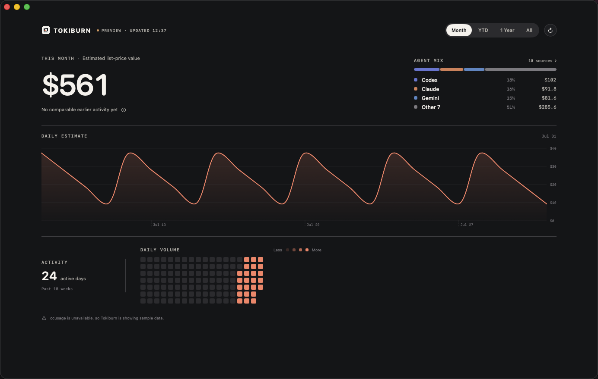

# Tokiburn

Tokiburn is a native macOS dashboard for understanding local AI coding-agent
usage. It turns aggregate `ccusage` history into a calm, one-page view of
estimated API-equivalent cost, provider mix, daily activity, and longer-term
rhythm.



> The screenshot uses Tokiburn's deterministic preview dataset. No personal
> usage history, prompts, transcripts, or billing data are included in this
> repository.

## What it shows

- month, year-to-date, trailing-year, and all-time estimates;
- equivalent prior-period comparison for month, YTD, and trailing-year views;
- an exact, non-reflowing pointer tooltip on the daily trend;
- a provider mix that stays usable with many sources;
- an 18-week activity field with factual active-day totals;
- persistent light and dark appearances.

Cost is explicitly labeled as a list-price API-equivalent estimate, not an
amount billed. Unknown or unpriced models remain at zero instead of receiving
an invented price.

## Privacy

Tokiburn is local-first:

- no account, analytics, telemetry, or Tokiburn-operated network service;
- `ccusage` is invoked in offline mode;
- only aggregate dates, provider labels, token counts, and estimates are stored;
- prompts and transcripts are never copied into Tokiburn's archive;
- the local archive is written with owner-only permissions.

Your history stays at:

```text
~/Library/Application Support/Tokiburn/usage-history.csv
```

The app repository deliberately ignores `data/` and all CSV files.

## Build

Requirements:

- macOS 15 or newer;
- Xcode;
- [XcodeGen](https://github.com/yonaskolb/XcodeGen);
- `ccusage` 20.0.19 available locally.

```sh
bun add --global ccusage@20.0.19
xcodegen generate
xcodebuild \
  -project Tokiburn.xcodeproj \
  -scheme Tokiburn \
  -configuration Debug \
  build
```

Tokiburn reads usage with:

```sh
ccusage daily \
  --sections daily,monthly \
  --by-agent \
  --json \
  --offline
```

## Keyboard shortcuts

| Shortcut | Action |
| --- | --- |
| `⌘1`–`⌘4` | Select a time period |
| `⌘R` | Refresh local usage |
| `⌘,` | Open settings |

## Tests

```sh
xcodebuild \
  -project Tokiburn.xcodeproj \
  -scheme Tokiburn \
  -configuration Debug \
  test \
  CODE_SIGNING_ALLOWED=NO
```

The tests cover decoding, calendar totals, comparison windows including leap
years, provider compaction, archive retention, CSV quoting, and legacy archive
migration.

## License

Tokiburn is available under the [MIT License](LICENSE).
